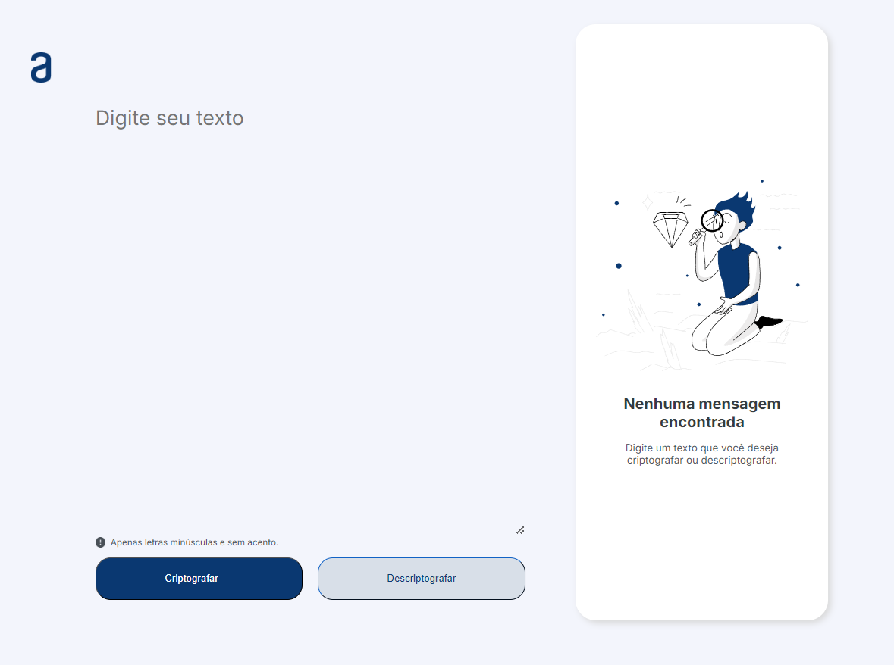
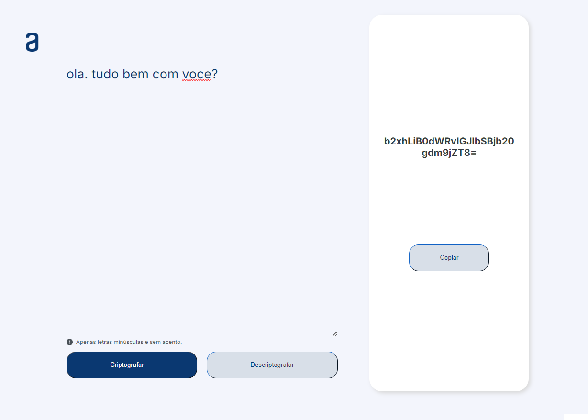

### Curso Oracle One + Alura

Projeto desenvolvido para curso realizado pela Oracle One e Alura.
Criação de um decodificador de texto.
  
 Ferramentas utilizadas: HTML, CSS, JavaScript
  
Imagens:
 
 
  
Link no Vercel: <a href="https://decodificador-oracle-alura.vercel.app/" target="_blank"> Meu decodificador de texto </a>
